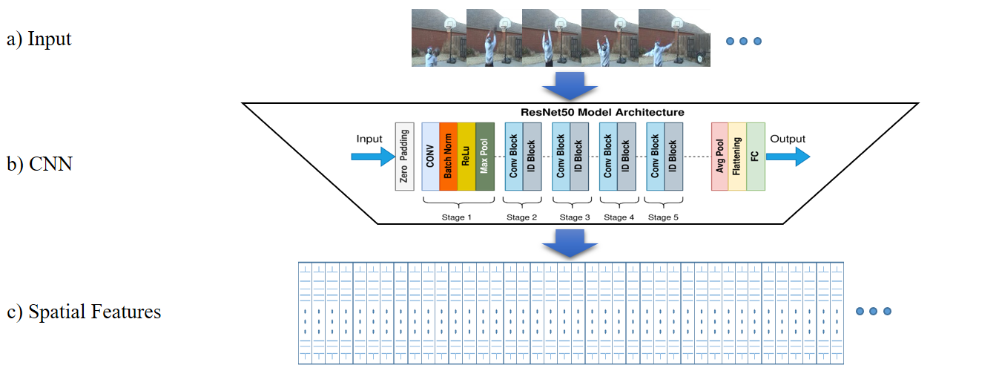

# Feature_Extraction
We have the feature extraction code in this repository. This code uses ResNet50 to extract spatial features from video frames.
This code is used in these two papers:
https://www.researchgate.net/publication/379714148_PDF_Temporal_Relations_of_Informative_Frames_in_Action_Recognition , https://www.researchgate.net/publication/368726751_Adaptive_Frame_Selection_In_Two_Dimensional_Convolutional_Neural_Network_Action_Recognition

### Examples

